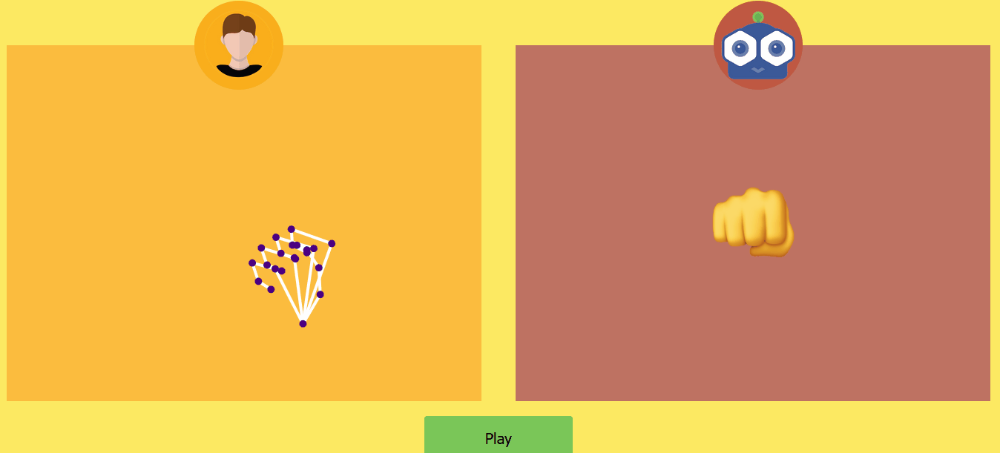

# Play Rock Paper and Scissors with your hands!
This project I made to experiment tensorflowjs and some other libs. This project is a website that allows you to play "RPS" using your hands (webcam required). It detects your hand and finger positions and use that as input.

